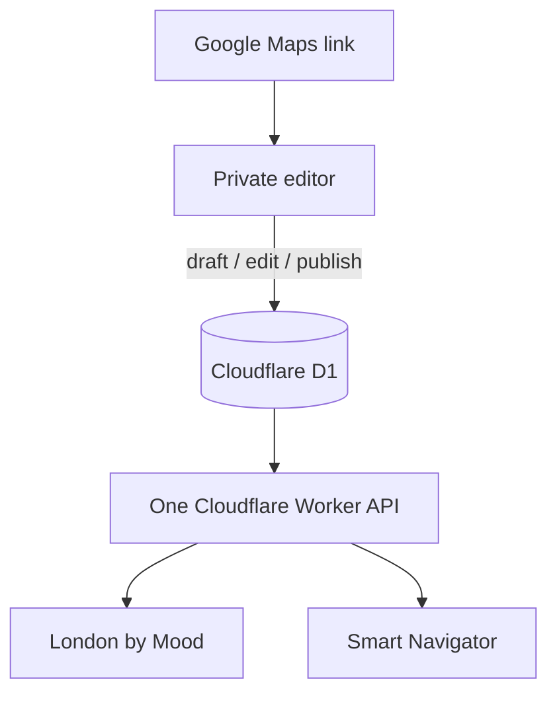

# D1 migration and application redesign

Status: development design and working prototype  
Date: 25 September 2026  
Production changes: none

## Decision

Use Cloudflare D1 as the single source of truth for the London Advanced place collection. Run London by Mood, Smart Navigator and a private maintenance interface from the same Worker and data model.

Keep Google My Maps as an optional discovery habit, not as the master database. The fastest normal workflow is to share or paste a Google Maps link into the private editor, complete the editorial fields, save it as a draft, then publish it after review.

## Why this shape

The existing workbook is doing four different jobs at once: source data, computed runtime tables, quality assurance and publishing. That creates many duplicated columns and makes both apps dependent on spreadsheet structure. The D1 model separates durable place facts, mood/time scoring, nearby-station relationships and revision history.

The current workbook audit found:

| Item | Current value |
|---|---:|
| Master places | 881 |
| Published/active places | 881 |
| Station relationships | 2,128 |
| Places with long guide descriptions | 172 |
| Spreadsheet tabs | 8 |
| Columns in `POI_MASTER` | 70 |

The complete 881-place collection is in the privately generated development seed, which is excluded from the public repository. Intentional collection outliers outside strict Greater London were preserved; the public address search remains London-bounded.

## Options considered

| Option | Editing experience | Runtime dependency | Control and audit | Recommendation |
|---|---|---|---|---|
| D1 + private editor | Paste a Maps link, edit a form, draft/publish | Cloudflare only | Strong validation and revision trail | **Recommended** |
| D1 + Google Form inbox | Familiar capture form, then a separate review step | Cloudflare + Google automation | Good, but reintroduces scripts and sync failure modes | Useful only if the private editor is rejected |
| Airtable/Notion/headless CMS | Polished table/CMS UI | New paid/external system plus API | Varies by product and plan | More overhead than this collection needs |
| Keep Google Sheet + Apps Script | Familiar grid | Current Google runtime chain | Weak schema enforcement; duplicated derived tabs | Not recommended |

## Target architecture

### D1 schema

- `places`: identity, coordinates, editorial copy, access, visitor context, mood scores, lifecycle status and source metadata.
- `place_time_affinity`: the 18 time-window scores used by London by Mood.
- `place_stations`: up to three ordered nearby stations per place.
- `categories`: controlled category vocabulary.
- `place_revisions`: append-only snapshots for create/update/publish/archive actions.
- `app_meta`: schema and data versions.

The application exposes `published` places publicly. Draft and archived records are visible only through the admin API.

### API surface

| Endpoint | Purpose | Access |
|---|---|---|
| `GET /api/pois` / `GET /api/places` | Shared published place feed with search/category/bounding-box filters | Public |
| `GET /api/geocode` | Explicit London-bounded address lookup | Public |
| `POST /api/route` | Walking route through openrouteservice | Public |
| `GET /api/bikepoints` | Nearby live Santander Cycles availability | Public |
| `POST /admin/api/resolve` | Convert a Maps link/name/address into a draft location | Private |
| `GET/POST /admin/api/places` | Search and create | Private |
| `GET/PUT /admin/api/places/:id` | Read and edit a record | Private |

## Redesigned Smart Navigator

The old Google Apps Script UI has been rebuilt under `/smart-navigation/` in the same Worker as London by Mood. The visitor:

1. searches for a start and destination;
2. chooses a 200 m or 500 m detour corridor and place categories;
3. receives an actual walking route from openrouteservice;
4. sees London Advanced places ordered along that route; and
5. can view live nearby Santander Cycles availability at the start.

This removes Google Apps Script from the request path and makes both public apps consume the same records and rules.

## Recommended maintenance workflow

### Normal discovery

1. In Google Maps, use **Share → Copy link**.
2. On a phone or desktop, open `/admin/` and paste the link into **Quick capture**.
3. The editor resolves coordinates and prepares an unpublished draft.
4. Add category, description/hook, visit time, access notes and mood scores.
5. Save as **Draft** when research is incomplete; switch to **Published** only after checking the record.

The public tools update from D1 immediately after normal edge/browser cache expiry. No spreadsheet edit, Apps Script redeployment or Git commit is required.

### Optional My Maps inbox

Continue pinning discoveries to a private “Inbox” layer if that is useful in the field. Periodically export that layer to KML/KMZ and import the new items as drafts. Treat this as an assisted batch intake, not two-way synchronization. My Maps’ supported workflows are file/spreadsheet import and KML/KMZ export rather than a dependable record-writing API.

### Bulk work

Add a CSV/KML draft importer as phase 2 if batch discovery is frequent. It should create drafts, report duplicates by name/proximity and require review before publication. Do not let bulk imports directly publish.

## Security and operating controls

- Put Cloudflare Access in front of `/admin/*`, which contains the editor and its API, with Paolo’s approved identity/email as the allow policy.
- Keep the local `ADMIN_TOKEN` fallback for development only. Never place it in Git or client code.
- Set `TRUST_CF_ACCESS=true` only after the exact Access path is active. The Worker also requires an Access assertion and the exact configured email.
- Use separate `london-advanced-places-dev` and production D1 databases.
- Store `HEIGIT_API_KEY`, optional `TFL_API_KEY` and any temporary admin token as Worker secrets.
- Preserve the revision table and export a periodic D1 backup before bulk edits.
- Keep public write routes nonexistent; all state-changing methods live under `/admin/api/`.

## Development and cutover plan

### Phase 1 — complete in this branch

- D1 schema and privately held full 881-place seed.
- D1-backed public API.
- London by Mood compatibility.
- Smart Navigator replacement UI.
- Private draft/publish editor.
- Automated unit and complete-data integration tests.

### Phase 2 — hosted development review

- Create a development D1 database and bind it only to a branch preview.
- Apply the migration and seed.
- Protect admin routes with Cloudflare Access.
- Add the development routing key.
- Review mobile/desktop layouts and sample records across all eight categories.
- Reconcile at least 20 workbook rows and all 172 long descriptions against D1.
- Test Google Sites embedding with the preview URL, without changing production embeds.

### Phase 3 — production migration, only after explicit approval

1. Freeze spreadsheet edits briefly and export a final workbook snapshot.
2. Generate a final seed/delta and run count, duplicate, coordinate and category checks.
3. Create and back up the production D1 database.
4. Apply migrations and import the checked data.
5. Deploy the Worker, smoke-test public and admin endpoints, then update the two Google Sites embeds.
6. Keep the spreadsheet and old Apps Script read-only for at least two weeks.

### Rollback

If acceptance checks fail, restore the prior London by Mood Worker version and the original Smart Navigator Apps Script embed. Because the spreadsheet and script remain unchanged/read-only through the observation window, rollback does not require reconstructing source data.

## Acceptance criteria

- `/api/pois` returns 881 published places and all 2,128 station relationships before any post-migration edits.
- London by Mood ranking tests remain green.
- Smart Navigator can resolve two London points, calculate a route and list matching detours.
- A private user can create a draft from a Google Maps link, edit it, publish it and see a revision record.
- Anonymous users cannot read drafts or call any admin write endpoint.
- Both public apps render correctly when embedded in Google Sites on mobile and desktop.
- No production deployment, binding or embed changes occur until explicit approval.

## Official references validated for this design

- D1 Worker bindings: <https://developers.cloudflare.com/d1/worker-api/d1-database/>
- D1 migrations: <https://developers.cloudflare.com/d1/reference/migrations/>
- D1 local development: <https://developers.cloudflare.com/d1/best-practices/local-development/>
- D1 limits: <https://developers.cloudflare.com/d1/platform/limits/>
- Cloudflare Access self-hosted applications: <https://developers.cloudflare.com/cloudflare-one/applications/configure-apps/self-hosted-apps/>
- Google My Maps export: <https://support.google.com/mymaps/answer/3109452>
- Google My Maps import: <https://support.google.com/mymaps/answer/3370982>
